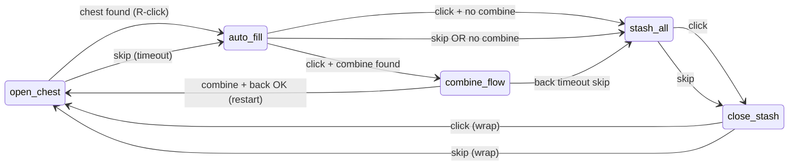
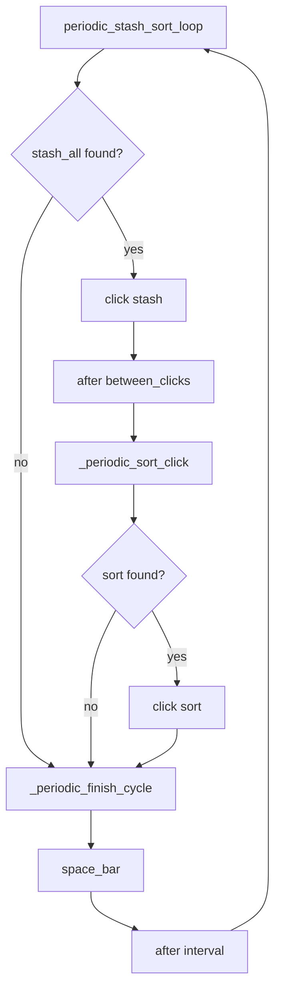
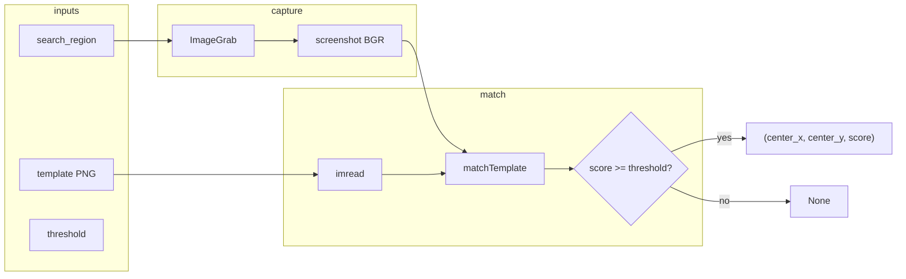

# Automation architecture

TBH Helper runs two cooperating mechanisms:

1. **Stash state machine** — `functionality/stash_loop.py` — ordered UI steps, combine branch, timeouts, and skip/restart rules. Driven by `tkinter` `after()` callbacks (no threads).
2. **Template matcher** — `functionality/image_search.py` plus `utils/config.py` template resolution — capture region, OpenCV match, threshold gate, screen coordinates for clicks.

Entry when the user clicks **Start Stash** (`gui/gui_functions.py`): `reset_stash_state()` → `stash_loop()` and `start_periodic_stash_sort()` in parallel. **Stop** sets `gv.continue_stash = False`; both loops exit on their next tick.

---

## Stash state machine

### State variables

| Symbol | Module | Meaning |
|--------|--------|---------|
| `gv.continue_stash` | `utils/global_variables.py` | `True` while automation runs |
| `gv.current_step_index` | same | Index into `config.yml` → `steps` (via `step_entries()`) |
| `gv.step_wait_deadline` | same | `time.monotonic()` deadline while polling for a missing template; `None` when not waiting |
| `gv.combine_check_pending` | same | Set after Auto Fill click until combine check runs |
| `gv.status_message` | same | Shown in GUI footer |

Steps are **not** a formal class; behavior is selected by `step["name"]` string and helper functions.

### Main step ring

Default `steps` order (from `resources/config.yml`):

| Index | Name | Template | Click |
|-------|------|----------|-------|
| 0 | `open_chest` | *(none — uses `chest_check` list)* | Right-click first matching chest |
| 1 | `auto_fill` | `auto_fill.png` | Left click → combine sub-flow |
| 2 | `stash_all` | `stash_all.png` | Left click |
| 3 | `close_stash` | `back_arrow.png` | Left click |

After `close_stash`, `_advance_to_next_step()` wraps index with `% len(steps)` back to `open_chest`.



### Scheduler model

Every transition schedules the next work with `gv.root.after(delay_ms, callable, ...)`. Delays come from `random_delay_ms()` / `random_timeout()` on min/max ranges in config (seconds → ms for `after`).

| Delay key | Used when |
|-----------|-----------|
| `timeouts.loop` | Re-poll while template missing |
| `timeouts.step_wait` | Max wall time for one missing-template episode (deadline set once per episode) |
| `timeouts.after_click` | After successful click, skip, or restart |
| `combine_flow.wait` | After Auto Fill, before combine check |

### `stash_loop()` dispatch

```
stash_loop
├── continue_stash? ─no→ stop
├── step = steps[current_step_index]
├── step.name == "open_chest"? ─yes→ _handle_open_chest_step
└── find_template(step.template)
    ├── None + step_wait timed out → _skip_to_next_step
    ├── None → set deadline, after(loop) → stash_loop
    └── match → click
        ├── auto_fill → after(combine_flow.wait) → _check_combine_after_auto_fill
        └── else → _advance_to_next_step, after(after_click) → stash_loop
```

### Open chest (`_handle_open_chest_step`)

Scans `chest_check.templates` in order (boss chest, then normal chest). First `find_template` hit wins.

- **Found:** clear wait deadline → right-click → `_advance_to_next_step("open_chest")` → `stash_loop`.
- **Not found:** poll with `timeouts.loop` until `step_wait` expires → `_skip_to_next_step("open_chest")`.

### Combine sub-flow (after `auto_fill`)

Runs outside the step index advance until resolved:

1. Wait `combine_flow.wait` (random).
2. `_check_combine_after_auto_fill`:
   - **No combine template:** jump `current_step_index` to `stash_all` (no step_wait polling).
   - **Combine found:** click combine; look for `combine_flow.back_template`.
     - **Back immediate:** click back → `_restart_loop()` (index = 0).
     - **Back missing:** poll `_click_back_after_combine` with `timeouts.loop` / `step_wait`; on timeout → `_skip_to_next_step` (from index still at `auto_fill` → next is `stash_all`).

`_restart_loop()` only runs after a **successful** combine + back sequence.

### Skip vs restart

| Function | Effect |
|----------|--------|
| `_advance_to_next_step(name)` | `(index + 1) % n` after successful action |
| `_skip_to_next_step(label)` | Same index math after timeout; logs warning; uses `after_click` delay |
| `_restart_loop(msg)` | `index = 0`; used after combine+back success |

### Periodic stash/sort (parallel machine)

Independent loop: `periodic_stash_sort_loop` → optional stash click → `_periodic_sort_click` → `_periodic_finish_cycle` (Space + reschedule).

- Missing **stash** or **sort** template: skip that click only; no `step_wait` / skip of main steps.
- Does not modify `current_step_index`.



### Changing the state machine

| Change | Touch |
|--------|--------|
| Add/reorder step | `resources/config.yml` `steps`, `stash_loop.py` if new `name` branch |
| New chest icon | `chest_check.templates` |
| Combine assets | `combine_flow.template`, `back_template` |
| Timing | `timeouts.*`, GUI Timing tab |

Step `name` values are matched in code (`== "open_chest"`, `== "auto_fill"`). New names need explicit handling in `stash_loop.py`.

---

## Template matcher

“Template machine” here means the path from **config basename** → **PNG on disk** → **screen search** → **click coordinates**. Implementation is stateless per call: each poll is one `find_template()` invocation.

### Resolution pipeline (`utils/config.py`)

```
GUI / YAML basename (e.g. auto_fill.png)
    → base_template_name()     # strip scale suffix if present
    → scaled_template_name()   # append _1-25 | _1-50 | _2 from window_scale
    → assets/{name} on disk
    → template_path_for()      # prefer scaled file; warn + fallback to base
```

Call sites use `template_path_for(StringVar)` via `step_entries()`, `chest_check_entries()`, or combine/periodic keys.

| Scale | Suffix | Example |
|-------|--------|---------|
| 1 | *(none)* | `auto_fill.png` |
| 1.25 | `_1-25` | `auto_fill_1-25.png` |
| 1.5 | `_1-50` | `auto_fill_1-50.png` |
| 2 | `_2` | `auto_fill_2.png` |

### Search pipeline (`functionality/image_search.py`)

```
search_region (x, y, width, height)  screen coords
    → ImageGrab.grab(bbox)
    → BGR numpy array
    → cv.imread(template_path)
    → cv.matchTemplate(TM_CCOEFF_NORMED)
    → max score + top-left loc
    → if score >= threshold:
           return (center_x, center_y, score) in screen space
       else None
```



### Matcher contract

| Input | Role |
|-------|------|
| `region` | Limits capture and converts match offset to screen coordinates |
| `template_path` | Absolute path to PNG; must fit inside region |
| `threshold` | `matching.threshold` from config (0–1); higher = stricter |

| Output | Meaning |
|--------|---------|
| `(cx, cy, score)` | Best match center in **screen** pixels |
| `None` | Below threshold, unreadable template, or region smaller than template |

DEBUG logs include best score and top-left location even when below threshold.

### Who calls `find_template`

| Caller | Templates |
|--------|-----------|
| `stash_loop` | Current step, chest list, combine, back |
| `periodic_stash_sort_loop` | Periodic stash, sort |

Clicks add `random_click_offset()` in `stash_loop` (`_click_at` / `_right_click_at`), not inside `image_search`.

### Tuning matching

| Symptom | Knob |
|---------|------|
| Never finds UI | Region too small/wrong; wrong `window_scale`; threshold too high |
| False positives | Raise threshold; tighten region; recapture template |
| Finds but clicks wrong place | Template crop includes shifting pixels; reduce crop to stable art |

Templates should be small, high-contrast crops captured at the same resolution and UI scale as gameplay.

### Adding a new template

1. Add PNG under `assets/` (and scaled variants if needed).
2. Reference **base** filename in YAML or GUI (`foo.png`).
3. Resolve through `template_path_for()` at runtime — do not hardcode scaled names in YAML.

---

## File map

| Concern | File |
|---------|------|
| State machine | `functionality/stash_loop.py` |
| Template search | `functionality/image_search.py` |
| Paths, scale, steps list | `utils/config.py` |
| Runtime flags | `utils/global_variables.py` |
| Persisted steps/templates | `resources/config.yml` |
| Start/stop | `gui/gui_functions.py` |

See also [README.md](../README.md) (user-facing usage) and [AGENTS.md](../AGENTS.md) (agent conventions).
